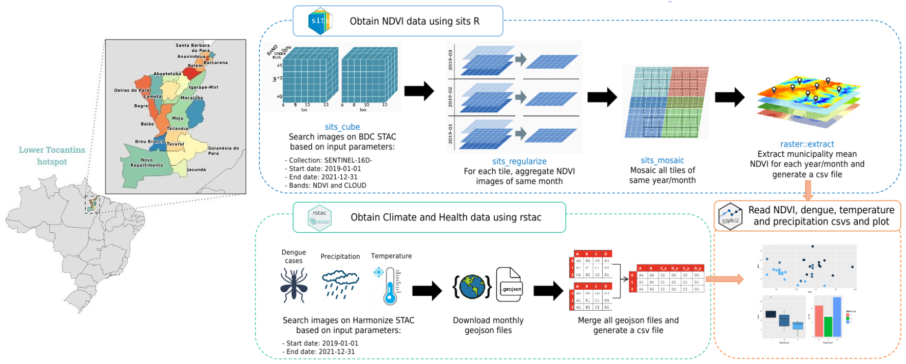

<h1 style='color:#336699;' align=center>BDC Lab Demostration - 2024 Harmonize Annual Meeting</h1>

  
  
  

    Luana Becker da Luz
    
    , Ana Paula Dal'Asta
    
     
     
    Earth Observation and Geoinformatics Division, National Institute for Space Research (INPE)
     
    Avenida dos Astronautas, 1758, Jardim da Granja, São José dos Campos, SP 12227-010, Brazil
      
    Contact: 
    <a href="mailto:luana.luz@inpe.br">luana.luz@inpe.br;</a>
    <a href="mailto:ana.dalasta@inpe.br">ana.dalasta@inpe.br;</a>
    <a href="mailto:miguel.monteiro@inpe.br">miguel.monteiro@inpe.br</a>
     
     
    

        

            

              This repository contains Jupyter notebooks codes that access collections and technologies generated and developed by EODCtHRS Harmonize Brazil. The codes compute monthly NDVI, dengue cases, rainfall and temperature data for each municipality of ROI.
            

        

    

 

  • <a href="#methodology">Methodology</a> &nbsp;
  • <a href="#jupyter-notebooks">Jupyter Notebooks</a> &nbsp;

## Methodology

The ROI includes 21 municipalities in the Lower Tocantins Hotspot and is shown in the image below.

<h1 align="center">
  
</h1>

### 1. Compute Health and Climate data: 
In this part, we used RSTAC client to query health and climate data on Harmonize STAC between start and end dates and then merge all GeoJSON dataframes in a single dataframe.
### 2. Compute NDVI data:
In this part, we used sits R package to query Sentinel 2 NDVI data on BDC STAC between start and end dates, aggregate each tile monthly, mosaic tiles of same month and then extract municipality mean for each month in a single dataframe.
### 3. Plot health, climate and ndvi csvs:
In this part, we opened precipitation, temperature, dengue and ndvi generated dataframes (csv files) and then ploted all monthly data in scatter plots.

## Jupyter Notebooks

There are 3 main codes in this repository:

- **1. Compute Health and Climate data:** This code implements [part 1 of methodology](#1-compute-health-and-climate-data)
- **2. Compute NDVI data:** This code implements [part 2 of methodology](#2-compute-ndvi-data)
- **3. Plot health, climate and ndvi csvs:** This code implements [part 3 of methodology](#3-plot-health-climate-and-ndvi-csvs)